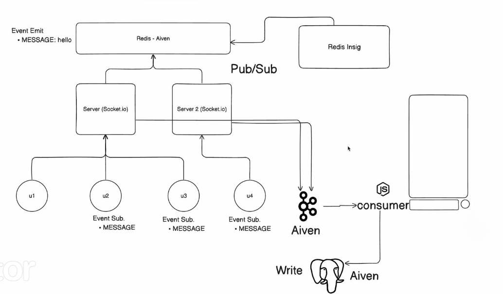

# Scaling WebSockets with PostgreSQL, Kafka and Redis


## Project Overview

This project demonstrates a scalable WebSocket implementation using Node.js, Socket.io, Kafka, and Redis. The architecture enables seamless communication between clients through WebSocket, while also ensuring scalability and fault tolerance through Kafka and Redis. The integration of Kafka allows for message persistence and further processing, while Redis facilitates real-time communication among multiple server instances.

### Technologies Used

- **Node.js**: JavaScript runtime for server-side development.
- **Socket.io**: Real-time bidirectional communication library for WebSocket implementation.
- **Kafka**: Distributed event streaming platform for handling real-time data feeds.
- **Redis**: In-memory data structure store acting as a message broker for WebSocket communication.
- **Prisma**: Database toolkit for interfacing with PostgreSQL.

## Architecture



1. **WebSocket Communication**: Clients communicate in real-time through Socket.io, which is integrated into the Node.js server.

2. **Redis for Pub/Sub**: Redis acts as a message broker using the publish/subscribe (Pub/Sub) pattern. It facilitates communication among different server instances.

3. **Kafka Integration**: Kafka is utilized for handling message persistence and enabling additional processing of WebSocket messages. Messages are produced to and consumed from Kafka topics.

4. **Database Interaction**: Prisma interacts with PostgreSQL to store WebSocket messages persistently.

## Scalability

### Horizontal Scaling

The WebSocket server can be horizontally scaled by deploying multiple instances. Redis ensures that messages are broadcasted to all connected clients across different server instances.

### Fault Tolerance

- **Redis**: As an in-memory data store, Redis ensures message persistence even if a server instance goes down. Clients can continue to receive messages seamlessly.

- **Kafka**: Kafka provides fault tolerance by replicating messages across brokers. If one broker fails, others can take over, ensuring no message loss.

### Performance Optimization

- **Kafka Batch Processing**: Kafka processes messages in batches, optimizing performance when dealing with a high volume of messages.

- **Redis In-Memory Store**: Redis, being an in-memory store, allows for quick retrieval and broadcasting of messages.

## Getting Started

1. Install dependencies:

    ```bash
    npm install
    ```

2. Configure environment variables

3. Start the application:

    ```bash
    npm start
    ```
4. Or you can spin up a docker container using:

    ```bash
    docker compose up
    ```

## Conclusion

This project demonstrates a scalable WebSocket architecture by integrating Redis and Kafka. It enables horizontal scaling, fault tolerance, and efficient communication between clients through WebSockets. Feel free to contribute, provide feedback, or use this project as a starting point for your real-time, scalable applications.
